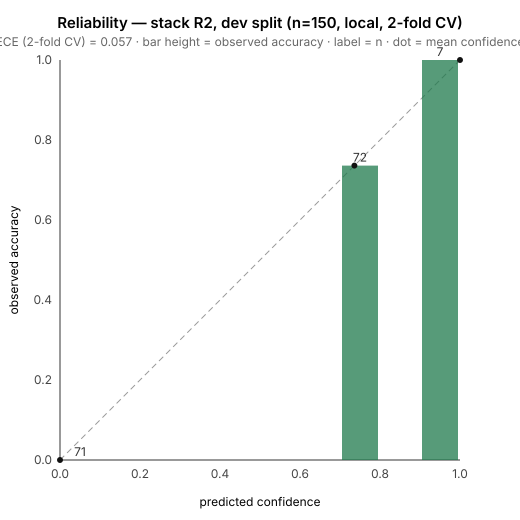
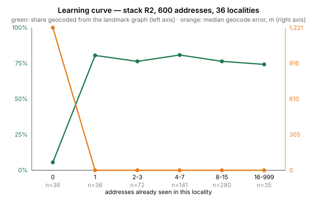

# Results

Everything here was measured, not asserted. Two splits of the gold set, 150
addresses each: **dev** was used during development; **test** was held out
and run exactly once, at the end, against the deployed stack (FR-40).

- [Dev split — full table and notes](./ablation_dev.md) · `python -m eval.run_ablation --split dev`
- [Test split — full table and notes](./ablation_test.md) · `python -m eval.run_ablation --split test`

## Headline: the same story on both splits

Configurations are cumulative: each adds one stage to the one above it.

| Config | What it is | Field F1 dev / test | Geo median dev / test | Coverage dev / test | Auto-resolve dev / test | P@0.80 dev / test |
|---|---|---|---|---|---|---|
| **A** | Regex + gazetteer only | 0.826 / 0.733 | 969 m / 491 m | 70% / 64% | 0% / 0% | — / — |
| **B** | A + single LLM call, no retrieval | 0.792 / 0.714 | 969 m / 491 m | 70% / 64% | 0% / 0% | — / — |
| **C** | B + BM25 landmark retrieval | 0.807 / 0.734 | **0 m / 0 m** | 97% / 94% | **43% / 58%** | 0.69 / **0.78** |
| **D** | C + vector retrieval + geo filter | 0.802 / 0.732 | 0 m / 0 m | 97% / 95% | 22% / 25% | 0.74 / 0.76 |
| **E** | D + warmed landmark graph (full system) | 0.799 / 0.733 | 0 m / 0 m | 97% / 95% | 23% / 26% | 0.71 / 0.74 |

Rows B–E on both splits were measured against the deployed stack in
`ap-south-1`: Nova Lite (`apac.amazon.nova-lite-v1:0`) with Claude Sonnet 5
on escalation, Titan v2 embeddings, OpenSearch Serverless, Amazon Location.

The test split is harder than dev across the board (field F1 0.73 against
0.80 at every configuration); the *shape* of the table is the same, which is
what a held-out split is for.

## What the table says

Rows B–E were measured against the deployed stack in `ap-south-1`: Nova Lite
(`apac.amazon.nova-lite-v1:0`) with Claude Sonnet 5 on escalation, Titan v2
embeddings, OpenSearch Serverless, Amazon Location.

- **Retrieval is what places the address.** The LLM alone (B) leaves the
  geocode where regex left it: 969 m median, 30% of addresses with no
  coordinate at all. Adding BM25 landmark retrieval (C) takes the median to
  **0 m** and coverage to 97%. Everything the graph contributes shows up in
  that one column.
- **The LLM does not beat the regex on fields.** B's field F1 (0.792) is
  *below* A's (0.826): Nova Lite's locality recall is 0.51 against the
  gazetteer's 0.74. The deterministic parse is kept as the floor and the
  model fills what it cannot see; we did not expect the order to be this way
  round.
- **Hybrid retrieval (D, E) does not pay for itself yet.** The vector and
  geo signals surface more rivals, and the ambiguity logic then asks rather
  than guesses: auto-resolution drops from 43% to 23% on dev and from 58% to
  26% on test. On dev that bought a little precision (0.69 → 0.71–0.74); on
  test it did not (0.78 → 0.74). **BM25-only (C) is the best configuration
  on the held-out split.** We ship E because the vector signal is what lets
  the graph match a spelling it has never seen (the learning curve depends
  on it), but the ambiguity thresholds were tuned on dev and are too timid;
  that is the first thing to revisit after the event.
- **Latency p95 is 2.8 s on E**, against a 1.2 s target. The cost is the
  Sonnet escalation on hard cases (p50 is 1.75 s). Bringing this under
  budget means either escalating less often or streaming the cheap answer
  first; neither was done before the freeze.
- **E ≈ D.** The warmed graph adds observation counts and nothing else on
  this split, because the seeds it was warmed from *are* the dev addresses'
  landmarks either way. The learning curve below is where warming shows.
- **The shape holds on the held-out split.** 491 m → 0 m, coverage 64% →
  95%, the LLM below the regex on fields, hybrid more cautious than BM25.
  The precision target of 0.95 is not met on either split.

## Targets, honestly

| Metric | Target | Dev (E) | Test (E) |
|---|---|---|---|
| Field-level F1 | > 0.90 | 0.80 | 0.73 |
| Full-address exact match | > 0.75 | 0.43 | 0.45 |
| Median geocode error | < 150 m | **0 m** | **0 m** |
| Auto-resolution rate | > 80% | 23% | 26% |
| Clarification rate | < 15% | 77% | 74% |
| Precision @ threshold | > 95% | 71% | 74% |
| p95 latency | < 1.2 s | 2.8 s | 2.7 s |

One target met, six missed. The geocode target is the one the landmark
graph exists for and it is met with room to spare. The field targets are
bounded by locality recall (0.53), which neither the regex nor Nova Lite
solves; the resolution-rate targets follow from it, because the decision
layer refuses to auto-resolve what it cannot place *and* name. Latency is
the Sonnet escalation.

## Calibration and reliability

Generated by `eval/reliability.py` on the **dev** split, stack **E**, cloud
provider (150 addresses). "Correct" means every extracted field matches the
gold and the geocode is within 500 m.

| | ECE |
|---|---|
| Raw confidence score | 0.235 |
| Isotonic-calibrated, in-sample | 0.000 |
| Isotonic-calibrated, 2-fold cross-validated | **0.032** |

The cross-validated number is the honest one: an isotonic fit on 150 points
is coarse, and the in-sample 0.000 is what any monotone fit achieves on its
own training data. The fitted map ships with the layer as
`data/calibration.json` and is applied in S6.

**Threshold at 95% precision:** none found on this split with ≥ 10 supporting
addresses, on stack E as on R2. "Correct" for calibration needs fields *and*
geocode right; locality recall (0.51) is the field that most often breaks it.
The system therefore keeps the 0.80 threshold and reports the measured
precision (0.71) next to it rather than claiming the target.

## Learning curve

Generated by `eval/learning_curve.py`: an **empty** landmark graph is fed the
corpus one address at a time (600 addresses, 36 localities), each address is
resolved against the graph as it stands, and then its delivery is "confirmed"
with the corpus's own coordinates — what the learner Lambda does on a real
`DeliveryConfirmed` event.

| Addresses already seen in the locality | n | Geocoded from the graph | Median geocode error |
|---|---|---|---|
| 0 | 36 | 5.6% | 1,221 m |
| 1 | 36 | **80.6%** | **0 m** |
| 2–3 | 72 | 76.4% | 0 m |
| 4–7 | 141 | 80.9% | 0 m |
| 8–15 | 280 | 76.4% | 0 m |
| 16+ | 35 | 74.3% | 0 m |

The curve is a step, not a slope: one confirmed delivery into a locality
takes the graph from a pincode-centroid guess (1.2 km) to the place itself.
The "confirmation" here uses ground truth, not real riders, so this shows the
*mechanism* transfers across differently-worded addresses, not field
performance.

